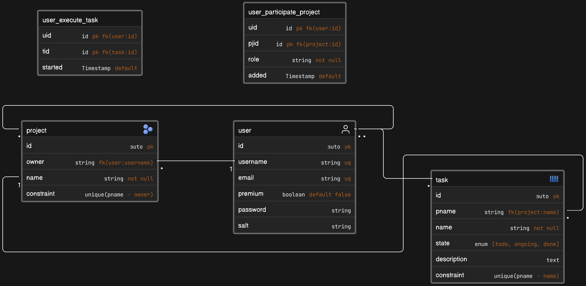

# Project Description
It is a personal-learning project that sets up the development of a ToDo web application with live chat. While the concept of ToDo app has not been developed, it has fully functional distributed chat servers developed in python with websockets and Redis as orchestrator.

## Used Tech
- Docker for networking management; Replicas Control; Live programming sessions with virtualized volumes; Multi-Service isolation
- Python WebSockets for chat service development cooperating with Redis as orchestrator in DNS-RoundRobin for replicas load-balance and Nginx to dispatch connections to the base endpoint of the chat cluster.
- Java with SpringBoot as data server with JPA and session management with Redis, using VIPs to keep session consistency among multiple replicas without necessity of Nginx balancer
- Redis In-Memory db as:
    * Chat State orchestrator for pynet servers, keeping track of online servers and their connected clients
    * Session Manager in javanet to maintain temporary tokens defining users' authentication sessions within the application
- MySQL DBMS in javanet as main data-holder for well-structured information and privacy-relevant information.
- MongoDB DBMS in pynet as chat database for messages and notification persistency
- Angular with TailwindCSS for frontend development interacting in both pynet and javanet

## Chat Service
Chat service is developed in pynet consiting of: N python chat server replicas, a Redis state orchestrator, and a MongoDB instance collecting information about messages and notifications. Chat Servers are fully developed with Python WebSockets where two main actors are found:
* Clients -> the frontend users that are connected together by signaling their presence on the network using Redis Session control
* Servers -> which are the available Python Chat servers where users are dispatched by VIP-based balancer. Each Server:
    * Regularly notifies its presence with its connected users list in a expiring key-value pair (if a server doesn't notify its presence anymore a fault is detected and the list of users is moved to other available servers)
    * Keeps track of the list of connected users and available servers in a cache, when a message is sent, the cache is first used to dispatch the message where the destination user is located, if the destination server is no longer present Redis is queried to find the new destination

This configuration allows multiple replicas of chat servers to be used that are configurable in the [docker configuration file](./docker-compose.yml#L105) 

## Project Service
Projects management is developed in javanet consisting of: N java replicas keeping permanent session with cliens via VIPs, a Redis session manager for expirations and session control/validation; a MySQL DBMS to keep users data persistency.

Replicas here are not cooperating, but rather acting independently where each server initializes an own pool of connections with the Redis Session Manager and the MySQL Data Manager. Interaction is implemented by using JPA repositories with JPQL for querying and interaction with both. Data are modeled in [EJB/entities directory](./JavaContainer/src/main/java/com/personal/njtodo/EJBs/entities/) following the ER design schema that follows: 

Endpoints are served with Jakarta Servlets, and exploit Middleware Filters like authentication filters and CORS filters allowing secure connections and endpoints isolation from unauthenticated users.

## Interface Service
Interface is developed in Angular, with the help of TypeScript for more reliable interaction with the Java server. It provides:
* caching via web-browser storage via angular/core
* payload validations via angular/forms
* services for real-time update and in particular chat service for websocket-based notification handling
* pipelines to transform received DTOs format in representable and clearer forms (in particular for messaging time-formats)
* tailwindCSS for styling 